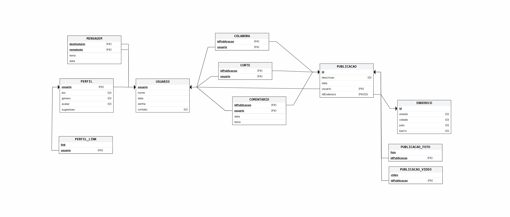

# Atividade 3 - Construção dos Comandos SQL para uma Aplicação Web existente
## Identificação da Aplicação

- **Aplicação:** Instagram
- **Descrição:** O Instagram é uma rede social digital focada no compartilhamento de fotos e vídeos. Pertencente à empresa Meta, o conceito central do aplicativo gira
em torno da comunicação visual, permitindo que usuários publiquem momentos do dia a dia, sigam perfis de interesse e interajam por meio de curtidas, comentários e mensagens diretas.

## Equipe
- Sarah Beatriz Barbosa do Nascimento 
- Thiago Gonsalves da Silva
- Samuel Chad Dantas da Silva 

## Modelos de Dados

### Modelo Relacional

### Dicionário de dados

**Tabela Usuario**

| Campo | Valor |
|-------|-------|
| Descrição | Armazena os dados dos usuários da plataforma |
| Observações | Representa qualquer pessoa cadastrada na plataforma |

**Campos**

| Nome | Descrição | Tipo de dado | Tamanho | Null | PK | FK | Unique | Identity | Default | Outras restrições de integridade |
|------|-----------|--------------|---------|------|----|----|--------|----------|---------|----------------------------------|
| usuario | Nome de usuário único do usuário | VARCHAR | 50 |  | SIM |  | SIM |  |  |  |
| nome | Nome próprio do usuário | VARCHAR | 64 |  |  |  |  |  |  |  |
| senha | Senha única para login do usuário | VARCHAR | 255 |  |  |  |  |  |  |  |
| data | Data de nascimento do usuário | DATETIME |  |  |  |  |  |  |  |  |
| contato | Contato para identificação, proteção e recuperação da conta do usuário (pode ser número de telefone ou e-mail) | VARCHAR | 255 |  |  |  | SIM |  |  |  |

---

**Tabela Perfil**

| Campo | Valor |
|-------|-------|
| Descrição | Armazena os dados do perfil de um usuário na plataforma |
| Observações | Representa os dados públicos e privados de qualquer pessoa cadastrada na plataforma |

**Campos**

| Nome | Descrição | Tipo de dado | Tamanho | Null | PK | FK | Unique | Identity | Default | Outras restrições de integridade |
|------|-----------|--------------|---------|------|----|----|--------|----------|---------|----------------------------------|
| usuario | Nome de usuário único do usuário | VARCHAR | 50 | SIM | SIM | SIM |  |  |  |  |
| bio | Texto que o usuário escreve em seu perfil | VARCHAR | 150 |  |  |  |  |  |  |  |
| genero | Gênero do usuário ao qual o perfil pertence | VARCHAR | 50 |  |  |  |  |  |  |  |
| avatar | caminho da foto que fica no topo do perfil, como identificação | VARCHAR | 255 |  |  |  |  |  |  |  |
| sugestoes | Recomendações de outros usuários que o usuário pode decidir se quer mostrar no perfil ou não | BOOLEAN |  |  |  |  |  |  | FALSE |  |

---

**Tabela Mensagem**

| Campo | Valor |
|-------|-------|
| Descrição | Armazena as mensagens trocadas entre usuários |
| Observações |  |

**Campos**

| Nome | Descrição | Tipo de dado | Tamanho | Null | PK | FK | Unique | Identity | Default | Outras restrições de integridade |
|------|-----------|--------------|---------|------|----|----|--------|----------|---------|----------------------------------|
| destinatario | Nome de usuário do usuário que está recebendo a mensagem | VARCHAR | 50 |  | SIM | SIM |  |  |  |  |
| remetente | Nome de usuário do usuário que está enviando a mensagem | VARCHAR | 50 |  | SIM | SIM |  |  |  |  |
| texto | Conteúdo contido na mensagem | VARCHAR | 1000 |  |  |  |  |  |  |  |
| data | Data de envio da mensagem | DATETIME |  |  |  |  |  |  |  |  |

---

**Tabela Colabora**

| Campo | Valor |
|-------|-------|
| Descrição | Armazena os usuários que colaboram em uma publicação |
| Observações |  |

**Campos**

| Nome | Descrição | Tipo de dado | Tamanho | Null | PK | FK | Unique | Identity | Default | Outras restrições de integridade |
|------|-----------|--------------|---------|------|----|----|--------|----------|---------|----------------------------------|
| idPublicacao | Identificador da publicação que outro usuário colaborou | INTEGER |  |  | SIM | SIM |  |  |  |  |
| usuario | Identificador do usuário colaborador | VARCHAR | 50 |  | SIM | SIM |  |  |  |  |

---

**Tabela Curte**

| Campo | Valor |
|-------|-------|
| Descrição | Armazena os registros de curtidas dos usuários em publicações |
| Observações |  |

**Campos**

| Nome | Descrição | Tipo de dado | Tamanho | Null | PK | FK | Unique | Identity | Default | Outras restrições de integridade |
|------|-----------|--------------|---------|------|----|----|--------|----------|---------|----------------------------------|
| idPublicacao | Identificador da publicação curtida | INTEGER |  |  | SIM | SIM |  |  |  |  |
| usuario | Identificador do usuário que realizou a curtida. | VARCHAR | 50 |  | SIM | SIM |  |  |  |  |

---

**Tabela Perfil_Link**

| Campo | Valor |
|-------|-------|
| Descrição | Armazena os links que o usuario pode colocar no seu perfil pelo celular |
| Observações |  |

**Campos**

| Nome | Descrição | Tipo de dado | Tamanho | Null | PK | FK | Unique | Identity | Default | Outras restrições de integridade |
|------|-----------|--------------|---------|------|----|----|--------|----------|---------|----------------------------------|
| link | link colocado pelo usuario | VARCHAR | 255 |  | SIM | SIM |  |  |  |  |
| usuario | usuario que possui o perfil | VARCHAR | 50 |  | SIM | SIM |  |  |  |  |

---

**Tabela Publicacao**

| Campo | Valor |
|-------|-------|
| Descrição | Armazena informações das publicações |
| Observações |  |

**Campos**

| Nome | Descrição | Tipo de dado | Tamanho | Null | PK | FK | Unique | Identity | Default | Outras restrições de integridade |
|------|-----------|--------------|---------|------|----|----|--------|----------|---------|----------------------------------|
| id | identifica uma publicação | INTEGER |  |  | SIM | SIM | SIM |  |  |  |
| descricao | texto que o usuario pode escrever | VARCHAR | 255 |  |  |  |  |  |  |  |
| data | data de publicação | DATETIME |  |  |  |  |  |  | NOW |  |
| usuario | proprietario da publicação | VARCHAR | 50 |  | SIM |  |  |  |  |  |
| idEndereco | endereço da publicação | INTEGER |  |  | SIM | SIM |  |  |  |  |

---

**Tabela Publicacao_Foto**

| Campo | Valor |
|-------|-------|
| Descrição | Armazena as fotos dos videos carregados |
| Observações |  |

**Campos**

| Nome | Descrição | Tipo de dado | Tamanho | Null | PK | FK | Unique | Identity | Default | Outras restrições de integridade |
|------|-----------|--------------|---------|------|----|----|--------|----------|---------|----------------------------------|
| foto | caminho da imagem | VARCHAR | 255 |  | SIM |  |  |  |  |  |
| idPublicacao | publicação da foto | INTEGER |  |  | SIM | SIM |  |  |  |  |

---

**Tabela Publicacao_Video**

| Campo | Valor |
|-------|-------|
| Descrição | Armazena os caminhos do videos carregados |
| Observações |  |

**Campos**

| Nome | Descrição | Tipo de dado | Tamanho | Null | PK | FK | Unique | Identity | Default | Outras restrições de integridade |
|------|-----------|--------------|---------|------|----|----|--------|----------|---------|----------------------------------|
| video | caminho do video | VARCHAR | 255 |  | SIM |  |  |  |  |  |
| idPublicacao | publicação do video | INTEGER |  |  | SIM | SIM |  |  |  |  |

---

**Tabela Comentario**

| Campo | Valor |
|-------|-------|
| Descrição | Armazena comentarios em publicação feitas pelos usuarios do site |
| Observações |  |

**Campos**

| Nome | Descrição | Tipo de dado | Tamanho | Null | PK | FK | Unique | Identity | Default | Outras restrições de integridade |
|------|-----------|--------------|---------|------|----|----|--------|----------|---------|----------------------------------|
| idPublicacao | Publicação do comentario | INTEGER |  |  | SIM | SIM |  |  |  |  |
| usuario | usuario que comentou | VARCHAR | 50 |  | SIM | SIM |  |  |  |  |
| data | data de criação do comentario | DATETIME |  |  |  |  |  |  | NOW |  |
| texto | texto comentado | VARCHAR | 2200 |  |  |  |  |  |  |  |

---

**Tabela Endereco**

| Campo | Valor |
|-------|-------|
| Descrição | Armazena o endereço que o usuario desejou associar a postagem |
| Observações | Pelo menos uma das colunas do devem existir |

**Campos**

| Nome | Descrição | Tipo de dado | Tamanho | Null | PK | FK | Unique | Identity | Default | Outras restrições de integridade |
|------|-----------|--------------|---------|------|----|----|--------|----------|---------|----------------------------------|
| id | Identificador unico do Endereco | INTEGER |  |  | SIM | SIM |  |  |  |  |
| estado | Estado do endereço | VARCHAR | 255 |  | SIM |  |  |  |  |  |
| cidade | Cidade do endereço | VARCHAR | 255 |  | SIM |  |  |  |  |  |
| bairro | Bairro do endereço | VARCHAR | 255 |  | SIM |  |  |  |  |  |
| pais | Pais do endereço | VARCHAR | 255 |  | SIM |  |  |  |  |  |
